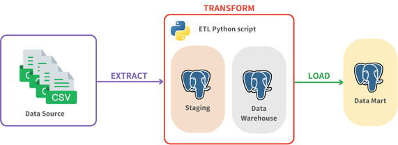

# Attendance ETL Pipeline

## Introduction
The project shows the data pipeline of a univesity attendance. The source is a four CSV files consist of the courses, student enrollment, courses schedule, and student attendance details. The data need to be ingested and transform into the data warehouse and data mart using a Python script.

## Architecture


## Technologies
- Python
- PostgreSQL
- Docker

## Getting Started
1. Clone the repository.
   ```
   git clone https://github.com/alyamutiara/attendance-etl-pipeline.git
   ```
2. Navigate to the project directory.
   ```
   cd attendance-etl-pipeline
   ```
3. Run Docker Compose to spin up the services.
   ```
   docker compose up
   ```